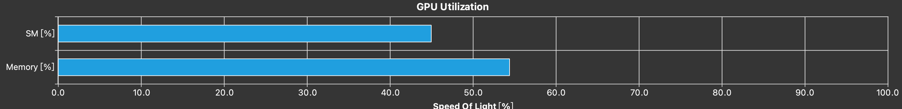

#### test_l2_cache 

编译命令：

```
/usr/local/cuda/bin/nvcc test_l2_cache.cu
/usr/local/cuda/nsight-systems-2020.4.3/bin/nsys profile --stat=true ./a.out
```
背景：

Cuda 11开始，8.0架构开始可以控制驻留L2 cache的数据， [L2 cache](https://docs.nvidia.com/cuda/cuda-c-best-practices-guide/index.html#L2-cache)

test_l2_cache用于测试设置驻留L2 cache数据的效果。

在Relu1调用前设置了10M cache 驻留保存y指针的数据。Relu2用y作为in，所以Relu2会有加速。在Relu2调用前设置了10M cache驻留保存z指针的数据，所以Relu3会有加速。

```
stream_attribute.accessPolicyWindow.hitRatio 代表给定一段数据有多大概率命中
stream_attribute.accessPolicyWindow.hitProp = cudaAccessPropertyPersisting; 代表命中的行为，是驻留在L2cache中
stream_attribute.accessPolicyWindow.missProp = cudaAccessPropertyNormal； 代表未命中的行为
```

这段代码在A100 PCIE 40GB上的结果是：

```
 Time(%)  Total Time (ns)   Average   Minimum  Maximum             Name
 -------  ---------------   --------  -------  -------  ---------------------------
    35.6           34,144    34,144.0   34,144   34,144  Relu1(long, float*, float*)
    33.6           32,193    32,193.0   32,193   32,193  Relu3(long, float*, float*)
    30.7           29,440    29,440.0   29,440   29,440  Relu2(long, float*, float*)
```

Relu2和Relu3相对Relu1有加速，因为数据驻留在L2 cache中。

这些设置在3090上没有效果，在A100上有效果。


#### test_nccl

编译命令：

```
/usr/local/cuda-11.4/bin/nvcc test_nccl.cu -I /usr/local/nccl_2.10.3-1+cuda11.4_x86_64/include/ -L /usr/local/nccl_2.10.3-1+cuda11.4_x86_64/lib/ -lnccl
export LD_LIBRARY_PATH=/usr/local/nccl_2.10.3-1+cuda11.4_x86_64/lib/

/usr/local/cuda-11.4/bin/nvcc test_nccl.cu -I /usr/local/nccl_2.10.3-1+cuda11.4_x86_64/include/ -L /usr/local/nccl_2.10.3-1+cuda11.4_x86_64/lib/ -lnccl_static

test_nccl.cu is test nccl allreduce half float group call.
```

背景：

nccl2.10.3支持了bfloat16数据类型，在我更新了nccl 版本后，发现resnet50网络中allreduce部分有bfloat16会不收敛，出现nan。此外发现这个版本float16也不收敛了，实验排查确认是nccl版本的问题。此外还有现象是采用cpu decoder，会在collective boxing executor后报700内存访问的错误。不运行不同数据类型fuse进一个group就不会发生这些情况。

本测试文件是构造的2卡的混合数据类型的allreduce，一个float类型，一个float16类型，nccl版本2.10.3在A100上动态链接会报`an illegal memory access was encountered`错误，nccl版本2.9.8没问题，向nccl官方提了issue，已fix，等待下一个版本发布。

#### test_copy_benchmark
编译命令：
```
A100 sm_80, 3090 sm86, 2080Ti sm75, V100 sm70
/usr/local/cuda-11.4/bin/nvcc test_copy_benchmark.cu -arch=sm_80 -O3 -std=c++11
```
运行ncu命令：
```
cuda 11.2:
sudo /usr/local/cuda-11.2/bin/ncu --section ".*" -f ./a.out
```

cuda 11.4命令发生了变化，直接跑上述命令会报错：

```
==ERROR== Option '--section .*' did not match any section.
```

查文档，将`--section .*`改成`--section "regex:.*"` 后，会报错：

```
==ERROR== Failed to access the following 8 metrics: nvlrx__bytes.sum, nvlrx__bytes.sum.pct_of_peak_sustained_elapsed, nvlrx__bytes_data_protocol.sum, nvlrx__bytes_data_user.sum, nvltx__bytes.sum, nvltx__bytes.sum.pct_of_peak_sustained_elapsed, nvltx__bytes_data_protocol.sum, nvltx__bytes_data_user.sum
```

原因是这台机器没有nvlink，需要改成如下命令：

```
cuda 11.4:
/usr/local/cuda-11.4/bin/ncu --section regex:'^(?!Nvlink)' -f ./a.out
```

背景：  

使用CopyKernel测试不同数据大小、不同pack_size下，能达到的显存带宽上限，作为Cuda Kernel优化的依据。详见[Copy-Benchmark](doc/copy_benchmark.md)


#### test_softmax

cudnn 8.3 的softmax速度快了不少，基于cudnn8.3做了和oneflow性能测试比较，详见[Softmax](doc/softmax.md)

#### test_layer_norm

基于apex做了和oneflow性能测试比较，详见[LayerNorm](doc/layer_norm.md)

#### UncoalescedAccess
cuda 11.3开始的bug or feature?
做测试发现cuda11.3开始的nvcc可能会把PackType的读写拆成多个指令，导致线程间的Uncoalesced global access。
最小复现代码在[test_nvcc.cu](./test_nvcc.cu)
CopyKernel0和CopyKernel1唯一的区别在row的循环是int还是int64_t，如果使用cuda11.3开始的nvcc编译，CopyKernel0是正常的一次Load 64 一次Store 64，CopyKernel1是一次Load 64，两次Store 32，产生了Uncoalesced global access。

#### event统计nccl通信时间 

基于test_nccl的测试脚本增加了event记录时间，编译方式和test_nccl相同，nccl group通信要在ncclGroupStart和ncclGroupEnd外加event统计通信时间。代码在[test_event_record_nccl_time.cu](./test_event_record_nccl_time.cu)

#### conv_algo_search

cuDNN Conv的计算通常是在初始化阶段调用SearchAlgo的算法搜索出可用的算法，在执行时传入选择的算法执行。如前向计算，cudnnGetConvolutionForwardAlgorithm_v7(启发式搜索) 和cudnnFindConvolutionForwardAlgorithmEx（试跑搜索）可以搜索出可用算法，cudnnConvolutionForward 执行前向计算。注意cudnnFindConvolutionForwardAlgorithmEx试跑搜索是要把所有的算法都跑一遍统计时间等，所以采用试跑搜索时，用nsys量时间需要注意可能把试跑执行的kernel也统计进去了。

经常会遇到需要单独测量或验证某种参数下convolution的性能，因此准备一个测试文件不用每次重复写了，代码在[test_conv_algo.cu](./test_conv_algo.cu)，包括forward、data backward、filter backward的搜索算法及执行，可以选择启发式搜索或试跑算法，也可以直接选定算法用nsys测量。

目前在TestConv函数中用了一组默认参数，及默认调用了前后向所有的搜索算法和执行算法，模板参数是数据类型，调用搜索算法会将每个算法的time、workspacesize等打印出来，如果测试某一种需要将其他的调用注释掉。

编译：

```
/usr/local/cuda/bin/nvcc test_conv_algo.cu -arch=sm_80 -O3 -I/usr/local/cudnn-11.4-linux-x64-v8.2.2.26/cuda/include/ -L/usr/local/cudnn-11.4-linux-x64-v8.2.2.26/cuda/lib64/ -lcudnn
```

执行前需要export LD_LIBRARY_PATH：

```
export LD_LIBRARY_PATH=/usr/local/cudnn-11.4-linux-x64-v8.2.2.26/cuda/lib64/:$LD_LIBRARY_PATH
```

在这个文件默认的参数中，是一个depwise conv，测试发现在cudnn 8.1上，搜索出来最快的算法都很慢。在V100上测试

cudnn 8.1 版本前向最快4.33ms

```
algo: 0 mathtype: 0 time: 4.33123 memory: 0
algo: 2 mathtype: 0 time: 6.26957 memory: 78675968
algo: 1 mathtype: 0 time: 11.1559 memory: 6674560
algo: 4 mathtype: 0 time: 12.2796 memory: 15345408
algo: 5 mathtype: 0 time: 34.114 memory: 10913920
algo: 3 mathtype: 0 time: -1 memory: 0
algo: 6 mathtype: 0 time: -1 memory: 0
algo: 7 mathtype: 0 time: -1 memory: 0
```

cudnn 8.3的话，前向最快0.8ms：

```
algo: 2 mathtype: 0 time: 0.823712 memory: 0
algo: 1 mathtype: 0 time: 0.843552 memory: 0
algo: 0 mathtype: 0 time: 0.84752 memory: 0
algo: 4 mathtype: 0 time: 12.5845 memory: 15345408
algo: 5 mathtype: 0 time: 34.9381 memory: 10913920
algo: 3 mathtype: 0 time: -1 memory: 0
algo: 6 mathtype: 0 time: -1 memory: 0
algo: 7 mathtype: 0 time: -1 memory: 0
```

测试时遇到一个比较疑惑的问题，在8.1版本时，试跑算法统计的是4.33ms，但是看nsys结果是


nsys上统计的Total Time是6.787ms，是96个kernel总时间。为什么这个时间和试跑统计的4.33ms差别这么大呢？

仔细看nsys的图，发现它96个kernel是分在8个stream上的，为了将kernel overlap起来，所以总时间不是简单的叠加，所以虽然每个kernel时间长，但是总的时间线上应该是试跑统计的时间。


对于这种情况，应该用cuda Event统计的时间比较准，或者打开qdrep文件测量总的一段时间，不应该只看nsys命令行中统计的时间。

#### div操作的代价
在A100上实验当只有一个scalar div操作时，是否需要转成乘倒数，这时是计算密集型还是访存密集型，代码在[test_div_compute.cu](code/elemwise/test_div_compute.cu)
编译：

```
/usr/local/cuda-11.6/bin/nvcc test_div_compute.cu -arch=sm_80 -O3 -std=c++11
```
运行：
```
 /usr/local/cuda/bin/ncu --section ".*" --target-processes all -f ./a.out
```

包含不pack的NotPackCopyKernel和NotPackDivKernel，pack 4的PackCopyKernel和PackDivKernel和使用elemwise模板的div测试

使用float类型测试：
NotPackCopyKernel 132us 有效带宽904GB/s(是ncu显示的，实际有部分缓存，以时间为准)


NotPackDivKernel 142us 有效带宽836GB/s



PackCopyKernel 92.83us 有效带宽1.24TB/s


PackDivKernel 94.72us 有效带宽1.23TB/s


Elemwise: 94.3us 和PackDivKernel接近

以上类型换成int后，Copy 都不变

NotPackDivKernel 167us  有效带宽713GB/s

PackDivKernel 96.19us 有效带宽1.23TB/s


由以上测试可以得到结论：(1) elemwise操作都可以pack多个元素，可以不用将除法转乘法，但是pack_size=1，除法会影响性能。(2)整数除法比浮点除法更昂贵
