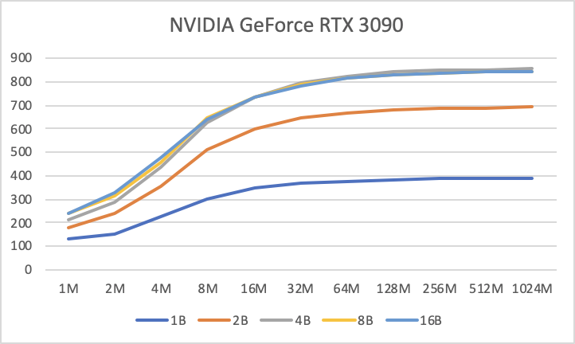
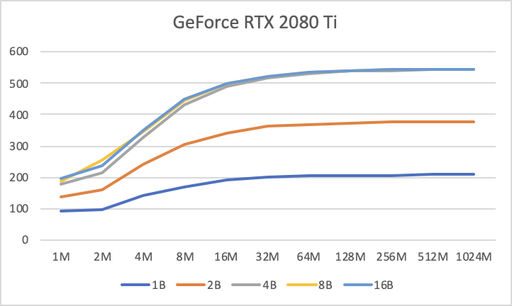

## Copy Benchmark

一般来说性能优化的目标是在对设备某种资源充分利用且对该资源需求无法降低情况下，达到最大性能。CUDA编程中我们常接触到的两种资源是计算资源和显存带宽资源，对于计算资源需求较高的Op如Conv、Matmul等都是用Cudnn、Cublas实现的，对这些Kernel一般情况下我们不会去优化，我们往往去优化受限于显存带宽的Kernel。对于显存带宽资源来说，充分利用指的是Kernel的有效显存读写带宽达到了设备显存带宽的上限。

Cuda Kernel操作的数据量的大小、Global Memory访存的单位都会对能达到的有效显存读写带宽有影响，表现在Cuda Kernel的性能上。

本文针对NVIDIA A100-PCIE-40GB、Tesla V100-SXM2-32GB、NVIDIA GeForce RTX 3090、GeForce RTX 2080 Ti GPU上评估不同数据量大小、global memory访存的单位对Copy操作能达到的有效显存读写带宽的影响。

下图中横轴代表数据量大小从1MB-1024MB变化，纵轴代表Copy操作达到的有效显存读写带宽(越高越好)，每条线代表从1Byte-16Byte的global memory访存单位，可以看到总体的趋势是随着数据量增大，达到的有效显存读写带宽越高，当数据量到一定范围后，达到的有效显存读写带宽趋于稳定，接近设备理论显存带宽。global memory访存单位越大，达到的有效显存读写带宽越高。

NVIDIA A100-PCIE-40GB

|       | 1B     | 2B     | 4B      | 8B      | 16B     |
| ----- | ------ | ------ | ------- | ------- | ------- |
| 1M    | 87.87  | 111.47 | 120.06  | 139.47  | 134.86  |
| 2M    | 120.26 | 171.12 | 208.73  | 218.47  | 231.59  |
| 4M    | 145.8  | 232.82 | 319.71  | 354.27  | 341.34  |
| 8M    | 164.67 | 283.71 | 431.16  | 488.17  | 493.84  |
| 16M   | 200.59 | 365.12 | 581.72  | 697.82  | 712.07  |
| 32M   | 265.6  | 503.41 | 830.7   | 1044.48 | 1085.44 |
| 64M   | 300.36 | 574.24 | 961.68  | 1228.8  | 1269.76 |
| 128M  | 316.85 | 608.89 | 1054.72 | 1320.96 | 1361.92 |
| 256M  | 327.76 | 627.55 | 1095.68 | 1351.68 | 1392.64 |
| 512M  | 334.57 | 635.59 | 1116.16 | 1372.16 | 1413.12 |
| 1024M | 338.12 | 639.86 | 1126.4  | 1382.4  | 1423.36 |

由图上可以看出对于NVIDIA A100-PCIE-40GB显卡，Global Memory访存单位为8Byte和16Byte的性能接近，访存单位为4Byte与8Byte有显著性能差距，2Byte相对于4Byte也有显著性能差距。说明对于常见的数据操作类型为float类型或half类型的CUDA Kernel，如果不能将几个元素的Global Memory访存操作pack到一起读写，而是一个元素一个元素操作，就一定会有性能问题。

Tesla V100-SXM2-32GB

|       | 1B     | 2B     | 4B      | 8B      | 16B     |
| ----- | ------ | ------ | ------- | ------- | ------- |
| 1M    | 87.87  | 111.47 | 120.06  | 139.47  | 134.86  |
| 2M    | 120.26 | 171.12 | 208.73  | 218.47  | 231.59  |
| 4M    | 145.8  | 232.82 | 319.71  | 354.27  | 341.34  |
| 8M    | 164.67 | 283.71 | 431.16  | 488.17  | 493.84  |
| 16M   | 200.59 | 365.12 | 581.72  | 697.82  | 712.07  |
| 32M   | 265.6  | 503.41 | 830.7   | 1044.48 | 1085.44 |
| 64M   | 300.36 | 574.24 | 961.68  | 1228.8  | 1269.76 |
| 128M  | 316.85 | 608.89 | 1054.72 | 1320.96 | 1361.92 |
| 256M  | 327.76 | 627.55 | 1095.68 | 1351.68 | 1392.64 |
| 512M  | 334.57 | 635.59 | 1116.16 | 1372.16 | 1413.12 |
| 1024M | 338.12 | 639.86 | 1126.4  | 1382.4  | 1423.36 |

由图上可以看出对于Tesla V100-SXM2-32GB显卡，Global Memory访存单位为4Byte、8Byte和16Byte的性能接近，访存单位为2Byte相对于4Byte有显著性能差距。说明对于常见的数据操作类型为float类型的Kernel，不把多个元素pack到一起读写，一个个操作，不会有明显的性能问题。而对于half类型，如果不能将几个元素的Global Memory访存操作pack到一起读写，而是一个元素一个元素操作，就一定会有性能问题。

NVIDIA GeForce RTX 3090

|       | 1B     | 2B     | 4B     | 8B     | 16B    |
| ----- | ------ | ------ | ------ | ------ | ------ |
| 1M    | 130.09 | 178.93 | 216.2  | 237.72 | 242.73 |
| 2M    | 154.55 | 236.9  | 285.12 | 311.85 | 327.94 |
| 4M    | 223.71 | 358.08 | 438.51 | 454.12 | 476.03 |
| 8M    | 301.91 | 511.81 | 626.91 | 647.04 | 642.87 |
| 16M   | 345.33 | 598.02 | 736.31 | 731.32 | 732.74 |
| 32M   | 367.42 | 647.05 | 794.96 | 788.7  | 781.61 |
| 64M   | 376.84 | 667.92 | 824.81 | 814.57 | 816.26 |
| 128M  | 382.96 | 680.56 | 841.24 | 829.76 | 831.64 |
| 256M  | 386.17 | 686.9  | 848.15 | 838.7  | 834.53 |
| 512M  | 387.76 | 689.87 | 852.74 | 840.73 | 841.66 |
| 1024M | 388.13 | 691.14 | 854.78 | 844.73 | 843.99 |

GeForce RTX 2080 Ti 

|       | 1B     | 2B     | 4B     | 8B     | 16B    |
| ----- | ------ | ------ | ------ | ------ | ------ |
| 1M    | 130.09 | 178.93 | 216.2  | 237.72 | 242.73 |
| 2M    | 154.55 | 236.9  | 285.12 | 311.85 | 327.94 |
| 4M    | 223.71 | 358.08 | 438.51 | 454.12 | 476.03 |
| 8M    | 301.91 | 511.81 | 626.91 | 647.04 | 642.87 |
| 16M   | 345.33 | 598.02 | 736.31 | 731.32 | 732.74 |
| 32M   | 367.42 | 647.05 | 794.96 | 788.7  | 781.61 |
| 64M   | 376.84 | 667.92 | 824.81 | 814.57 | 816.26 |
| 128M  | 382.96 | 680.56 | 841.24 | 829.76 | 831.64 |
| 256M  | 386.17 | 686.9  | 848.15 | 838.7  | 834.53 |
| 512M  | 387.76 | 689.87 | 852.74 | 840.73 | 841.66 |
| 1024M | 388.13 | 691.14 | 854.78 | 844.73 | 843.99 |

在由图上可以看出对于NVIDIA GeForce RTX 3090和GeForce RTX 2080 Ti 显卡，Global Memory访存单位为4Byte、8Byte和16Byte的性能几乎重合，访存单位为2Byte相对于4Byte有显著性能差距。说明对于常见的数据操作类型为float类型的Kernel，不需要把多个元素pack到一起读写。而对于half类型，如果不能将几个元素的Global Memory访存操作pack到一起读写，而是一个元素一个元素操作，就一定会有性能问题。

### 结论：

在Tesla V100及以下的显卡上，对于float类型数据的访存操作，不需要把多个元素pack到一起读写，但是half类型一定需要pack到4Byte及以上，才能更好利用带宽资源。

A100显卡以后，4Byte大小的float类型数据的访存操作也需要pack到8Byte及以上才能更好利用带宽资源。

