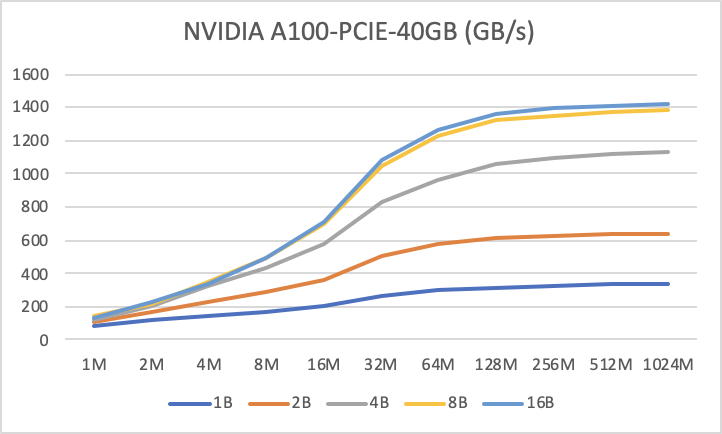

### CUDA优化实践之尽可能使用向量化内存操作

Nvidia性能优化的博客[Increase Performance with Vectorized Memory Access](https://developer.nvidia.com/blog/cuda-pro-tip-increase-performance-with-vectorized-memory-access/ )中提到可以通过向量化内存操作来提高CUDA Kernel性能，很多CUDA Kernel都是带宽受限的，使用向量化内存操作可以减少总的指令数，减少延迟，提高带宽利用率。文中比较了不同数据量下使用vector2、vector4向量化访存相对scalar访存的性能，发现向量化读写内存在任何情况下都会相比普通读写有性能提升。这个文章发布于2013年，几年来，GPU硬件有了很大提升，我们在较新的硬件上做了实验来评估向量化内存操作对CUDA Kernel性能的影响。我们测试了随着数据量从1MB-1024MB变化，1Byte-16Byte的内存读写粒度的性能表现。

下图中横轴代表数据量大小，纵轴代表Copy操作达到的有效显存读写带宽(越高代表性能越好)，每条线代表从1Byte-16Byte的读写

NVIDIA A100-PCIE-40GB

|       | 1B     | 2B     | 4B      | 8B      | 16B     |
| ----- | ------ | ------ | ------- | ------- | ------- |
| 1M    | 87.87  | 111.47 | 120.06  | 139.47  | 134.86  |
| 2M    | 120.26 | 171.12 | 208.73  | 218.47  | 231.59  |
| 4M    | 145.8  | 232.82 | 319.71  | 354.27  | 341.34  |
| 8M    | 164.67 | 283.71 | 431.16  | 488.17  | 493.84  |
| 16M   | 200.59 | 365.12 | 581.72  | 697.82  | 712.07  |
| 32M   | 265.6  | 503.41 | 830.7   | 1044.48 | 1085.44 |
| 64M   | 300.36 | 574.24 | 961.68  | 1228.8  | 1269.76 |
| 128M  | 316.85 | 608.89 | 1054.72 | 1320.96 | 1361.92 |
| 256M  | 327.76 | 627.55 | 1095.68 | 1351.68 | 1392.64 |
| 512M  | 334.57 | 635.59 | 1116.16 | 1372.16 | 1413.12 |
| 1024M | 338.12 | 639.86 | 1126.4  | 1382.4  | 1423.36 |

Tesla V100-SXM2-32GB

|       | 1B     | 2B     | 4B      | 8B      | 16B     |
| ----- | ------ | ------ | ------- | ------- | ------- |
| 1M    | 87.87  | 111.47 | 120.06  | 139.47  | 134.86  |
| 2M    | 120.26 | 171.12 | 208.73  | 218.47  | 231.59  |
| 4M    | 145.8  | 232.82 | 319.71  | 354.27  | 341.34  |
| 8M    | 164.67 | 283.71 | 431.16  | 488.17  | 493.84  |
| 16M   | 200.59 | 365.12 | 581.72  | 697.82  | 712.07  |
| 32M   | 265.6  | 503.41 | 830.7   | 1044.48 | 1085.44 |
| 64M   | 300.36 | 574.24 | 961.68  | 1228.8  | 1269.76 |
| 128M  | 316.85 | 608.89 | 1054.72 | 1320.96 | 1361.92 |
| 256M  | 327.76 | 627.55 | 1095.68 | 1351.68 | 1392.64 |
| 512M  | 334.57 | 635.59 | 1116.16 | 1372.16 | 1413.12 |
| 1024M | 338.12 | 639.86 | 1126.4  | 1382.4  | 1423.36 |

NVIDIA GeForce RTX 3090

|       | 1B     | 2B     | 4B     | 8B     | 16B    |
| ----- | ------ | ------ | ------ | ------ | ------ |
| 1M    | 130.09 | 178.93 | 216.2  | 237.72 | 242.73 |
| 2M    | 154.55 | 236.9  | 285.12 | 311.85 | 327.94 |
| 4M    | 223.71 | 358.08 | 438.51 | 454.12 | 476.03 |
| 8M    | 301.91 | 511.81 | 626.91 | 647.04 | 642.87 |
| 16M   | 345.33 | 598.02 | 736.31 | 731.32 | 732.74 |
| 32M   | 367.42 | 647.05 | 794.96 | 788.7  | 781.61 |
| 64M   | 376.84 | 667.92 | 824.81 | 814.57 | 816.26 |
| 128M  | 382.96 | 680.56 | 841.24 | 829.76 | 831.64 |
| 256M  | 386.17 | 686.9  | 848.15 | 838.7  | 834.53 |
| 512M  | 387.76 | 689.87 | 852.74 | 840.73 | 841.66 |
| 1024M | 388.13 | 691.14 | 854.78 | 844.73 | 843.99 |

GeForce RTX 2080 Ti 

|       | 1B     | 2B     | 4B     | 8B     | 16B    |
| ----- | ------ | ------ | ------ | ------ | ------ |
| 1M    | 130.09 | 178.93 | 216.2  | 237.72 | 242.73 |
| 2M    | 154.55 | 236.9  | 285.12 | 311.85 | 327.94 |
| 4M    | 223.71 | 358.08 | 438.51 | 454.12 | 476.03 |
| 8M    | 301.91 | 511.81 | 626.91 | 647.04 | 642.87 |
| 16M   | 345.33 | 598.02 | 736.31 | 731.32 | 732.74 |
| 32M   | 367.42 | 647.05 | 794.96 | 788.7  | 781.61 |
| 64M   | 376.84 | 667.92 | 824.81 | 814.57 | 816.26 |
| 128M  | 382.96 | 680.56 | 841.24 | 829.76 | 831.64 |
| 256M  | 386.17 | 686.9  | 848.15 | 838.7  | 834.53 |
| 512M  | 387.76 | 689.87 | 852.74 | 840.73 | 841.66 |
| 1024M | 388.13 | 691.14 | 854.78 | 844.73 | 843.99 |

由上图可以看出，对于NVIDIA GeForce RTX 2080 Ti 和GeForce RTX 3090 GPU，4Byte以上的访存粒度对性能提升不显著，4Byte、8Byte和16Byte大小的访存对带宽利用效果接近，2Byte相对4Byte有明显差距。对于Tesla V100-SXM2-32GB GPU，4Byte、8Byte和16Byte大小的访存性能有一点差别，2Byte的相对4Byte有明显差距。对于NVIDIA A100-PCIE-40GB GPU，4Byte相对8Byte和16Byte粒度的访存性能也有明显差别，2Byte相对4Byte也有明显差距。也就是说，对于Tesla V100及以下的GPU，不对float数据类型使用向量化操作影响有限，对half类型需要使用向量化操作。对于A100后的GPU，不仅需要对half数据类型使用向量化操作，对float数据类型也应该使用向量化操作，否则无法充分利用带宽资源，可能会有性能问题。使用向量化内存操作的方法是，对于数据移动类操作，可以分析当前操作有没有机会合并到更大的数据类型上去，再进行访存操作，只有当指针地址是对齐到更大数据类型的，并且数据大小可以被更大数据类型整除的情况，才能合并到更大类型。对于有计算的操作，可以用union结构，在数据加载和存储时使用更大的数据类型访存，在计算时访问元素实际的数据类型。

