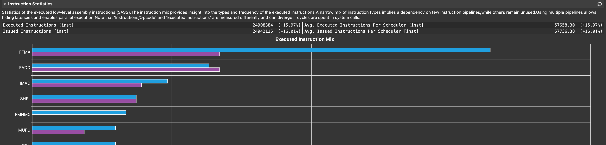

Cudnn 8.3版本宣称优化了Softmax的性能，这里用OneFlow和cudnn8.3版本进行对比，OneFlow使用的Softmax.cuh为https://github.com/Oneflow-Inc/oneflow/blob/13d133fddecbc6aa0a35eef6a0acb5405c61a482/oneflow/core/cuda/softmax.cuh 版本：

测试用例： num_rows固定为49152, num_cols 由32-32768变化。

#### 性能表格前向：

**NVIDIA A100-PCIE-40GB** Kernel的执行时间，单位us，越小越好

| col_size                  | 32    | 64    | 128   | 256   | 512    | 1024   | 2048   | 4096   | 8192 | 16384 | 32768 |
| ------------------------- | ----- | ----- | ----- | ----- | ------ | ------ | ------ | ------ | ---- | ----- | ----- |
| OneFlow 使用fast Div和exp | 13.47 | 21.15 | 31.17 | 44.77 | 76.19  | 144.42 | 383.39 | 742.27 | 1660 | 3550  | 7680  |
| OneFlow 使用fast Div      | 14.53 | 22.21 | 34.56 | 50.85 | 85.31  | 153.92 | 413.57 | 773.95 | 1720 | 4230  | 8560  |
| Cudnn                     | 20.38 | 25.44 | 35.62 | 60.26 | 104.58 | 502.37 | 672.19 | 1120   | 2710 | 8830  | 21150 |

注： Cudnn内部使用了除法转乘法，和上面表格第二行OneFlow计算对比是公平的。

**NVIDIA GeForce RTX 3090** Kernel的执行时间，单位us，越小越好

| col_size                  | 32    | 64    | 128   | 256   | 512    | 1024   | 2048   | 4096   | 8192 | 16384 | 32768 |
| ------------------------- | ----- | ----- | ----- | ----- | ------ | ------ | ------ | ------ | ---- | ----- | ----- |
| OneFlow 使用fast Div和exp | 10.30 | 17.63 | 32.70 | 61.73 | 121.50 | 239.94 | 483.39 | 960.51 | 1920 | 4280  | 10030 |
| OneFlow 使用fast Div      | 10.43 | 17.95 | 32.96 | 61.76 | 121.79 | 240.06 | 482.53 | 962.88 | 1920 | 4650  | 10220 |
| Cudnn 8.3                 | 16.26 | 18.43 | 33.86 | 63.39 | 122.30 | 557.15 | 707.01 | 1290   | 3580 | 9610  | 19520 |

注： Cudnn内部使用了除法转乘法，和上面表格第二行OneFlow 使用fast Div对比是公平的。

#### 性能表格后向：

**NVIDIA A100-PCIE-40GB** Kernel的执行时间，单位us，越小越好

| col_size | 32    | 64    | 128   | 256   | 512    | 1024   | 2048   | 4096 | 8192 | 16384 | 32768 |
| -------- | ----- | ----- | ----- | ----- | ------ | ------ | ------ | ---- | ---- | ----- | ----- |
| OneFlow  | 13.44 | 19.30 | 31.62 | 55.23 | 107.52 | 217.06 | 482.21 | 1020 | 2170 | 4090  | 11860 |
| Cudnn    | 16.48 | 20.03 | 32.19 | 59.46 | 114.66 | 346.11 | 594.21 | 1820 | 4460 | 9090  | 18450 |

**NVIDIA GeForce RTX 3090** Kernel的执行时间，单位us，越小越好

| col_size | 32    | 64    | 128   | 256   | 512    | 1024   | 2048   | 4096 | 8192 | 16384 | 32768 |
| -------- | ----- | ----- | ----- | ----- | ------ | ------ | ------ | ---- | ---- | ----- | ----- |
| OneFlow  | 13.28 | 24.80 | 46.88 | 92.29 | 179.04 | 356    | 713.63 | 1430 | 2970 | 7650  | 18540 |
| Cudnn    | 14.24 | 24.74 | 46.40 | 90.75 | 178.88 | 364.77 | 808.26 | 1860 | 4540 | 9290  | 18620 |

#### 测试前向过程中遇到的一些困难和解决过程：
在Softmax前向计算中比较昂贵的运算有除法和exp操作，在OneFlow中有编译选项OF_SOFTMAX_USE_FAST_MATH，开启后会使用fast的除法`__fdividef`和exp运算`__expf` ，此处与apex中一致，apex中编译默认会开启`--use_fast_math`，会优化包括除法、exp在内的一系列指令。

在与Cudnn Softmax比较中，为了公平性，先确认Cudnn实现中是否也使用了快速的div、exp等运算，由于Cudnn是闭源的，对比cudnn和oneflow采用fast math使用nsight compute生成的source code，发现使用的指令不同，猜测它未使用快速的exp和快速的除法。

发现新版本的Cudnn在cols<=512下相比原来的版本性能有很大提升，调用了softmax_fw_small_kernel，内部使用了ILP指令并行，在OneFlow中内部有向量化访存和指令并行，总体效果应该差不多。

但是测试发现在关闭OF_SOFTMAX_USE_FAST_MATH后，OneFlow在其中几个case上总是比Softmax差，尝试各种改动没有很大提升，后查看指令统计对比如下图，蓝色为OneFlow的执行指令，紫色为cudnn的执行指令，对比发现oneflow的FFMA指令多很多。

为什么会多很多呢，尝试提取一些公共表达式等均没有效果，又去生成的Source中查找FFMA指令，最终确认，Cudnn的除法是先求倒数再乘的，OneFlow中是在循环内直接除的。把OneFlow中也改成先求倒数，再在循环内乘，得到的就和Cudnn差不多了。

先求倒数再在循环内乘和使用快速除法对性能影响差不多，因此OneFlow 使用fast Div和Cudnn比较属于完全公平的比较。

测试代码在:[代码](../code/softmax/) 下

